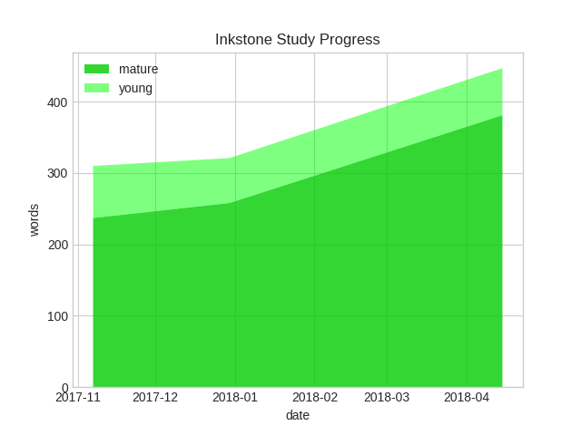
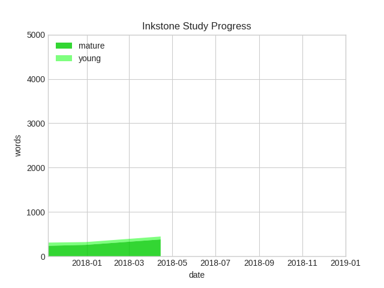

# Inkstone Progress Graph Generator

I am not affiliated with the creator of [Inkstone](https://www.skishore.me/inkstone/), but I created this tool for creating graphs of your study progress.

The tool uses the app's backup files (generated by going to "Settings" > "Backup to a file") to create each data point on the graph. You will need multiple backup files created on different dates in order to create a graph.

Mature words are distinguished from young words by having intervals (length of time from when you saw it last to when it is next due) longer than seven days.

## How to use this tool

(Note: These instructions were written for Linux, macOS, and other Unix-like systems. The overall procedure will be the same for Windows, however.)

* Download and install the latest version of [Python 3](https://www.python.org/downloads/).
* Move all your Inkstone `.bak` backup files  (generated by going to "Settings" > "Backup to a file") into one folder on your computer. You need multiple backup files created on different dates in order to create a graph.
* Save a copy of the `inkprog.py` file to this directory.
* Run `inkprog.py` via the terminal: `python3 inkprog.py`

If you would like to adjust the axes limits like the graph below, uncomment (delete the `#`) from the second- and third-to-last lines in `inkprog.py`. You will need to replace `YYYY`, `M`, and `D` in the third-to-last line with the end date of your choice.

